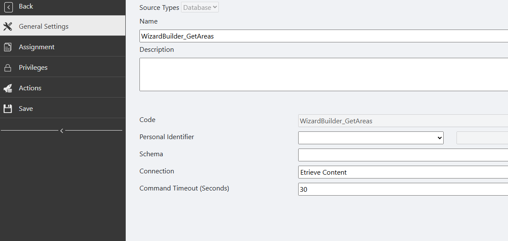
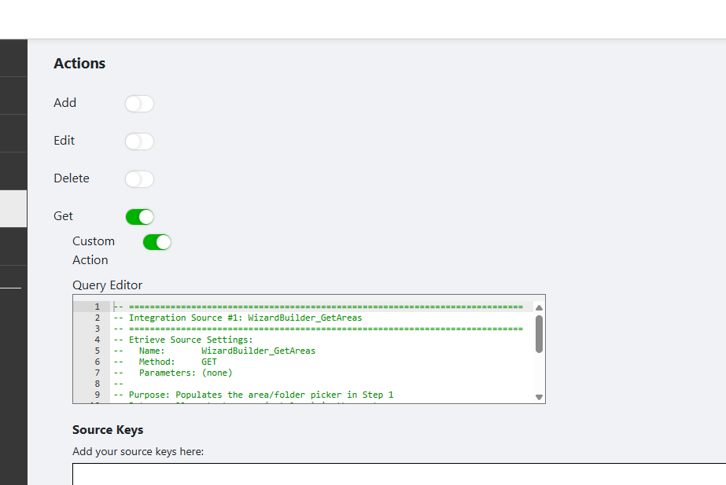
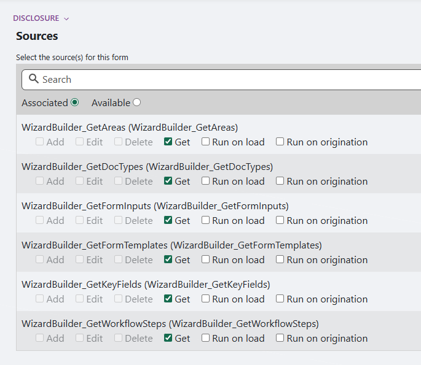

# Softdocs Dashboard Builder 3.0

Build dashboards for Softdocs Etrieve without writing code. Pick a style, point it at your data, and the wizard generates everything you need.

---

## What Does This Do?

This wizard builds **read-only dashboards** for Etrieve Content (scanned documents) and Central Forms (form submissions). You walk through a few screens, make your choices, and the wizard spits out all the files you need to deploy a working dashboard.

**What you get:**

* 12 dashboard styles (status boards, claims trackers, voting panels, and more)
* 3 data modes: Document Lookup, Form Tracker, or Combined
* Live preview while you build
* Auto-save (close the browser and come back later)

**What you need:**

* Etrieve Cloud (or on-prem with Hybrid Server)
* Admin access to create Sources and Forms in Etrieve Central
* A SQL connection to your Etrieve Content database

---

## Quick Start (4 Steps)

> **Time estimate:** About 15-20 minutes the first time. Most of that is creating the data sources (Step 1). After that, building dashboards takes about 2 minutes each.

---

### Step 1: Create 6 Data Sources

The wizard needs to read your Etrieve data. You do this by creating **6 integration sources** that the wizard calls behind the scenes.

**Where to go:** Etrieve Central > **Admin** (gear icon, top-right) > **Sources**

**For each source below, do these 4 things:**

1. Click **Add New Source**
2. On the **General Settings** tab:
   - Set the **Name** exactly as shown (copy-paste it)
   - Set **Connection** to your **Etrieve Content database** connection

   

3. On the **Actions** tab:
   - Check **Get**
   - Check **Custom Action**
   - Paste the SQL into the **Query Editor**
   - If the source has a **Source Key** (listed below the SQL), click **Add Source Key**, type the name exactly as shown, and set the type

   

4. On the **Privileges** tab:
   - Add the users or groups who will use the wizard
   - Check **Get** for each one
5. Click **Save**

> **Important:** The source **Name** must match exactly. If you name it differently, update `configuration.js` to match (see Troubleshooting).

Now create all 6 sources:

---

#### Source 1: `WizardBuilder_GetAreas`

Returns the list of document folders (Catalogs) for the folder picker.

**Source Keys:** None

```sql
SELECT
    CatalogID       AS id,
    [Name]          AS name
FROM [dbo].[Catalog]
ORDER BY [Name]
```

---

#### Source 2: `WizardBuilder_GetDocTypes`

Returns document types within a folder.

**Source Keys:** `@CatalogID` (Integer)

```sql
SELECT
    dt.DocumentTypeID   AS id,
    dt.[Name]           AS name,
    dt.[Name]           AS code
FROM [dbo].[DocumentType] dt
INNER JOIN [dbo].[CatalogDocumentType] cdt
    ON dt.DocumentTypeID = cdt.DocumentTypeID
WHERE cdt.CatalogID = @CatalogID
ORDER BY dt.[Name]
```

---

#### Source 3: `WizardBuilder_GetKeyFields`

Returns indexing fields (columns) available in a folder.

**Source Keys:** `@CatalogID` (Integer)

```sql
SELECT DISTINCT
    f.FieldID           AS id,
    f.[Name]            AS name,
    CASE
        WHEN dt.[Name] = 'Date' THEN 'date'
        ELSE 'text'
    END                 AS type,
    f.[Name]            AS alias
FROM [dbo].[Field] f
INNER JOIN [dbo].[DataType] dt
    ON f.DataTypeID = dt.DataTypeID
INNER JOIN [dbo].[DocumentTypeField] dtf
    ON f.FieldID = dtf.FieldID
INNER JOIN [dbo].[CatalogDocumentType] cdt
    ON dtf.DocumentTypeID = cdt.DocumentTypeID
WHERE cdt.CatalogID = @CatalogID
ORDER BY f.[Name]
```

---

#### Source 4: `WizardBuilder_GetFormTemplates`

Returns published form templates for the form picker.

**Source Keys:** None

```sql
SELECT
    tv.TemplateVersionID    AS id,
    t.[Name]                AS name,
    t.TemplateID            AS templateId
FROM reporting.central_forms_Template t
INNER JOIN reporting.central_forms_TemplateVersion tv
    ON t.TemplateID = tv.TemplateID
WHERE tv.IsPublished = 1
ORDER BY t.[Name]
```

---

#### Source 5: `WizardBuilder_GetFormInputs`

Returns input field IDs from submitted forms (used to build columns).

**Source Keys:** `@TemplateVersionID` (Integer)

```sql
SELECT DISTINCT
    iv.InputID  AS id,
    iv.InputID  AS label
FROM reporting.central_forms_InputValue iv
INNER JOIN reporting.central_forms_Form f
    ON iv.FormID = f.FormID
WHERE f.TemplateVersionID = @TemplateVersionID
    AND f.IsDraft = 0
ORDER BY iv.InputID
```

---

#### Source 6: `WizardBuilder_GetWorkflowSteps`

Returns workflow steps for a form template (used for workflow-based dashboards).

**Source Keys:** `@TemplateID` (Integer)

```sql
SELECT DISTINCT
    ps.ProcessStepId                AS id,
    ps.[Name]                       AS name,
    REPLACE(ps.[Name], '_', ' ')    AS displayName
FROM reporting.central_flow_ProcessStep ps
INNER JOIN reporting.central_flow_TaskQueue tq
    ON tq.ProcessStepID = ps.ProcessStepId
INNER JOIN reporting.central_flow_PackageDocument pd
    ON tq.PackageId = pd.PackageID
INNER JOIN reporting.central_forms_TemplateVersion tv
    ON pd.SourceTypeCode = tv.Code
WHERE tv.TemplateID = @TemplateID
    AND ps.IsDeleted = 0
ORDER BY ps.[Name]
```

> **Tip:** All 6 SQL queries are also in the `Sources/` folder as individual `.sql` files you can copy-paste from.

---

### Step 2: Upload the Wizard Files

1. Go to **Admin > Forms**
2. Click **Create** to make a new form
3. Name it whatever you want (e.g., "Dashboard Builder")
4. Upload **all 7 files** listed below

**Files to upload (all 7 are required):**

| # | Filename | What it does |
|---|----------|--------------|
| 1 | `index.html` | The wizard's page layout |
| 2 | `wizard.css` | Visual styling |
| 3 | `wizard-demo.js` | Wizard logic and navigation |
| 4 | `wizard-templates.js` | Step screens and download dialog |
| 5 | `wizard-generators.js` | Generates your dashboard files |
| 6 | `viewmodel.js` | Connects the wizard to Etrieve's data |
| 7 | `configuration.js` | Source name settings (edit if you renamed sources) |

> **Getting upload errors?** See Troubleshooting below. The most common issue is uploading files from an older version that only had 6 files.

---

### Step 3: Connect the Sources to the Form

1. Open the form you just created
2. Go to **Sources** (under the form's settings, or click **Connect** in the form editor)
3. Find each of the 6 `WizardBuilder_*` sources
4. Check the **Get** box for all 6 of them

It should look like this:



> **If you don't see your sources:** Make sure you saved them in Step 1. Also check that you're looking at the right form.

---

### Step 4: Open the Wizard

1. Open the form in Etrieve (just like opening any other form)
2. You'll see three big cards:
   - **Document Lookup** -- dashboards for scanned/indexed documents
   - **Form Tracker** -- dashboards for form submissions and workflows
   - **Combined View** -- both documents and forms in one dashboard
3. Pick one and follow the wizard screens
4. On the last screen, click **Get Dashboard Files**
5. Save each file to your computer (the wizard walks you through it)
6. Upload those generated files as a **new form** in Etrieve -- that's your dashboard!

---

## How the Wizard's File Saving Works

When you finish building a dashboard, the wizard shows you the generated files. Since Etrieve runs in a browser, you need to save each file to your computer before uploading them as a new form.

**The wizard gives you two ways to save each file:**

1. **Save File button** -- Downloads the file directly (works in most browsers)
2. **Copy to Clipboard button** -- Copies the file contents, then:
   - Open **Notepad** (Windows) or **TextEdit** (Mac)
   - Paste with **Ctrl+V** (or **Cmd+V** on Mac)
   - Click **File > Save As**
   - Use the exact filename shown in the wizard (e.g., `viewmodel.js`)
   - Repeat for each file tab

The wizard tracks which files you've saved with green checkmarks on each tab, and warns you if you try to close before saving all of them.

---

## Dashboard Styles

| Style | Best For |
|-------|----------|
| **Simple Status** | Color-coded lanes grouped by status (e.g., Pending, In Review, Complete) |
| **Request Type** | Grouping items by category or request type |
| **Expandable** | Click a row to expand and see detail fields |
| **Alpha Split** | Tabs that split by last name (A-H, I-P, Q-Z) |
| **Claims** | Claiming/unclaiming items with age tracking -- needs on-prem SQL |
| **Workflow Actions** | Approve/deny buttons tied to workflow steps |
| **PDF Signatures** | Track signature status on PDF documents |
| **Survey Analytics** | Charts and statistics for survey responses |
| **Award Nominations** | Track nominations by category and status |
| **Committee Voting** | Vote columns (approve/deny/abstain) -- needs on-prem SQL |
| **Cards Dashboard** | Visual card layout with status counts |
| **Bulk Actions** | Checkboxes for bulk approve/deny/reassign |

> **About "needs on-prem SQL":** Most styles use Etrieve's built-in features. Two styles (Claims and Committee Voting) need to write data back to track who claimed what or how people voted. Those two require an on-prem SQL Server connection via Hybrid Server.

---

## Troubleshooting

### Upload errors (403 or "Failed to upload file")

This usually means you have **old files** from a previous version. The wizard was recently split from 2 JavaScript files into 3 to work around a Cloudflare security filter.

**Fix:** Re-download all files from this repo and make sure you have all 7 files, including `wizard-templates.js`. Delete any old files in the form first, then re-upload everything.

### 403 errors when the wizard tries to load data

Your integration sources aren't connected properly.

**Check these things:**
1. Each source's **Connection** is set to your Etrieve Content database (not Etrieve Security or some other connection)
2. Each source has **Get** checked on the Actions tab
3. Your user has **Get** privilege on each source (Privileges tab)
4. The source is connected to the form (Step 3 above)

### Source names don't match

If you named your sources differently than `WizardBuilder_GetAreas`, etc., open `configuration.js` in the form editor and change the variable values to match your names. The variable names are self-explanatory:

```javascript
var areasIntegrationName = 'YourCustomName_GetAreas';
var docTypesIntegrationName = 'YourCustomName_GetDocTypes';
// ... etc.
```

### Wizard loads but shows no data

The sources are connected but returning empty results. This can happen if:
* Your Etrieve Content database connection is pointing to the wrong database
* The `reporting.*` views don't exist (needed for Forms mode -- these are Etrieve's reporting views)
* No forms have been submitted yet (Forms mode needs at least one non-draft submission)

### Form fields show IDs instead of friendly names

This is expected for the wizard's integration sources. The form InputIDs from Etrieve are technical identifiers. Once you deploy the finished dashboard, end users won't see these -- the dashboard maps them to the column labels you chose in the wizard.

---

## File Structure

```
softdocs-dashboard-builder/
  index.html              -- Wizard page layout
  wizard.css              -- Wizard styling
  wizard-demo.js          -- State management, navigation, utilities
  wizard-templates.js     -- Step renderers, download modal, preview
  wizard-generators.js    -- File generators, SQL builders
  viewmodel.js            -- Etrieve RequireJS wrapper
  configuration.js        -- Integration source name settings
  Sources/                -- SQL files for each integration source
    1_WizardBuilder_GetAreas.sql
    2_WizardBuilder_GetDocTypes.sql
    3_WizardBuilder_GetKeyFields.sql
    4_WizardBuilder_GetFormTemplates.sql
    5_WizardBuilder_GetFormInputs.sql
    6_WizardBuilder_GetWorkflowSteps.sql
    PROBE_*.sql           -- Schema discovery queries (for debugging)
    SCHEMA.md             -- Etrieve database schema reference
  docs/                   -- Setup screenshots
  README.md               -- This file
  INSTALL.md              -- Points here
  LICENSE                 -- MIT License
```

---

## License

Licensed under the [MIT License](LICENSE).

*Created by Michael Mohring, College of DuPage IT*
